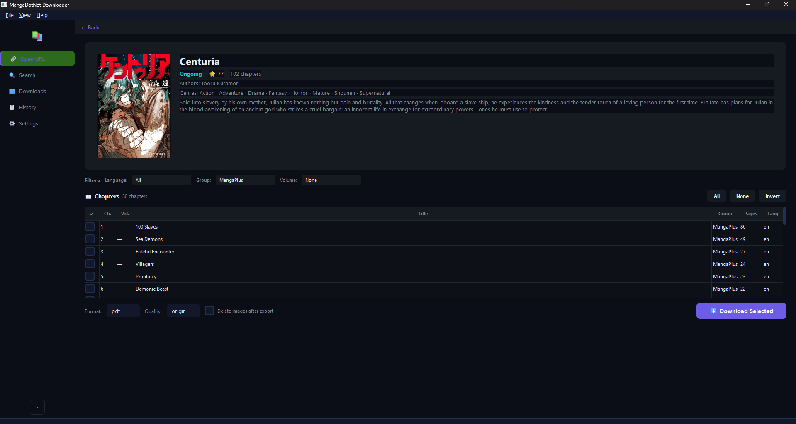

# 📚 MangaDotNet Downloader

> A beautiful, modern, feature-rich manga downloader for [MangaDotNet](https://mangadot.net) with both CLI and GUI interfaces.

[](https://python.org)
[](LICENSE)
[](https://rich.readthedocs.io)
[](https://www.riverbankcomputing.com)



---

## ✨ Features

### 🖥️ CLI (Typer + Rich)
- **🔍 Search** — Find manga by title with instant, beautifully formatted results
- **🔗 Info** — View manga details (title, status, rating, authors, genres, description)
- **⬇️ Download** — Download chapters with full control: range, latest N, all, by volume
- **📦 Batch** — Bulk download from JSON configuration files
- **💬 Interactive Shell** — Full menu-driven TUI with browse → download flow
- **📚 Library** — Manage your local manga collection with stats
- **📋 History** — Track all past downloads with status
- **⚙️ Settings** — View and edit settings with indexed, descriptive menus
- **🔄 Auto Update** — `git pull` to update to the latest version

### 🖼️ GUI (PyQt6)
- **Left Sidebar Navigation** — 6 tabs: Open URL, Search, Downloads, History, Settings
- **Modern Dark Theme** — Sleek GitHub-inspired design with purple accents
- **Search Grid** — Card-based manga browsing with cover art
- **Download Queue** — Parallel downloads with real-time progress tracking
- **History Page** — Beautiful card-based history with thumbnails and status badges
- **Full Settings Page** — Visual settings editor
- **Collapsible Sidebar** — Icon-only mode for more content space

### ⚡ Core Engine
- **Cloudflare Bypass** — Uses `undetected_chromedriver` for 100% reliable CF bypass
- **Concurrent Downloads** — Configurable parallel chapter and image downloads
- **Retry Logic** — Automatic retries with configurable delay
- **Smart Filtering** — Deduplication by language, group, and user preference

### 📦 Export Formats
| Format | Extension | Description |
|--------|-----------|-------------|
| **CBZ** | `.cbz` | Comic Book ZIP — works with CDisplayEx, Komga, Kavita, Tachiyomi |
| **ZIP** | `.zip` | Standard ZIP archive |
| **PDF** | `.pdf` | Multi-page PDF with bookmarks |
| **Images** | folder | Loose image files |
| **Folder** | folder | Images + metadata text file |

---

## 🚀 Quick Start

### Installation

```bash
# Clone the repository
git clone https://github.com/Yui007/mangadotnet-downloader.git
cd mangadotnet-downloader

# Install with GUI support
pip install -e ".[gui]"

# Or CLI only
pip install -e .
```

### CLI Usage

```bash
# Search for manga
mdnet search "solo leveling"

# View manga details
mdnet info 166

# Download chapters
mdnet download 166 --chapters 1-50 --format cbz

# Interactive shell (menu-driven TUI)
mdnet shell

# Check for updates
mdnet settings
```

### GUI Usage

```bash
mdnet-gui
```

---

## 💬 Interactive Shell

The interactive shell provides a beautiful menu-driven interface:

```
╭──────────────────────────────────────────────────────────────╮
│  📚 MangaDotNet Interactive Shell                           │
│                                                              │
│    1. 🔍 Search by name                                      │
│    2. 🔗 Search by URL / Manga ID                            │
│    3. 📖 Browse manga (chapters & volumes)                   │
│    4. ⬇️  Download manga                                     │
│    5. 📚 Local library                                       │
│    6. 📋 Download history                                    │
│    7. ⚙️  Settings                                           │
│    8. 🔴 Auto update                                         │
│    9. ❌ Exit                                                │
╰──────────────────────────────────────────────────────────────╯
```

### Browse → Download Flow

1. Select **3** (Browse) → Enter manga ID/URL
2. View chapters with filtering by language and group
3. Choose download selection: **All**, **Range** (e.g. `1-50`), **Specific** (e.g. `2,5,10`), or **Latest N**
4. Select format and download

### Settings

Settings are displayed with indexed options showing current values and descriptions:

```
⚙️ Settings
┏━━━━━┳━━━━━━━━━━━━━━━━━━━━━━━━━━┳━━━━━━━━━━━━━┳━━━━━━━━━━━━━━━━━━━━━━━━━━━━━━┓
┃ #   ┃ Setting                  ┃ Value       ┃ Description                  ┃
┡━━━━━╇━━━━━━━━━━━━━━━━━━━━━━━━━━╇━━━━━━━━━━━━━╇━━━━━━━━━━━━━━━━━━━━━━━━━━━━━━┩
│ 1   │ Output directory         │ ~/manga     │ Where downloaded manga is... │
│ 2   │ Default format           │ cbz         │ Export format for downloads  │
│ 3   │ Default language         │ en          │ Language filter              │
│ ... │ ...                      │ ...         │ ...                          │
└─────┴──────────────────────────┴─────────────┴──────────────────────────────┘

Enter a number (1-9) to edit, or 0 to go back
```

---

## ⚙️ Configuration

### Settings File

Settings are stored in `settings.json` in the project root:

```json
{
  "output_dir": "~/manga",
  "default_format": "cbz",
  "default_language": "en",
  "download": {
    "max_concurrent_chapters": 4,
    "max_concurrent_images": 8,
    "max_concurrent_downloads": 3,
    "max_retries": 3,
    "retry_delay": 2.0
  },
  "quality": {
    "default": "original",
    "delete_images_after_export": false
  },
  "gui": {
    "theme": "dark"
  }
}
```

### Environment Variables

All settings can be overridden with `MANGADOTNET_*` environment variables:

```bash
export MANGADOTNET_OUTPUT_DIR="/path/to/manga"
export MANGADOTNET_DEFAULT_FORMAT="pdf"
export MANGADOTNET_MAX_CONCURRENT_DOWNLOADS=5
export MANGADOTNET_GUI_THEME="midnight"
```

---

## 🎨 Themes

### CLI Colors
```
Primary:    #6C5CE7  (Electric Purple)
Secondary:  #00CEC9  (Turquoise)
Accent:     #FD79A8  (Hot Pink)
Success:    #00B894  (Mint Green)
Warning:    #FDCB6E  (Sunshine)
Error:      #E17055  ️
```

### GUI Themes
- **Dark** — GitHub-inspired dark theme (default)
- **Light** — Clean light theme
- **Midnight** — Deep blue midnight theme

---

## 🛠️ Development

```bash
# Install with dev dependencies
pip install -e ".[gui,dev]"

# Run tests
pytest

# Lint
ruff check src/

# Type check
mypy src/
```

---

## 📁 Project Structure

```
mangadotnet-downloader/
├── src/manga_dotnet/
│   ├── core/              # Models, config, history, updates
│   ├── api/               # API client, search, chapters, images, manga
│   ├── export/            # CBZ, ZIP, PDF, Images, Folder exporters
│   ├── cli/               # CLI commands, widgets, interactive shell
│   │   └── commands/      # search, info, download, batch, library, history, settings
│   └── gui/               # PyQt6 GUI with sidebar navigation
│       ├── pages/         # Open URL, Search, Downloads, History, Settings
│       └── widgets/       # Download panel, search bar, manga cards
├── tests/                 # Test suite
├── pyproject.toml         # Project config
├── settings.json          # User settings (auto-created)
└── README.md
```

---

## 🔄 Auto Update

The app includes a built-in auto-update feature that pulls the latest changes from GitHub:

```bash
# In the interactive shell, select option 8
mdnet shell
# 8 → Auto update → Checks for updates → Pulls latest changes
```

---

## 📋 CLI Reference

### Search
```bash
mdnet search "query" [--limit 20] [--lang en] [--adult]
```

### Info
```bash
mdnet info <manga_id_or_url>
```

### Download
```bash
mdnet download <manga_id_or_url> [options]

Options:
  -c, --chapters TEXT     Chapter range (e.g. 1-50,100)
  -v, --volumes TEXT      Volume range (e.g. 1-5)
  -n, --latest INT        Download latest N chapters
  --all                   Download all chapters
  -o, --output PATH       Output directory
  -f, --format TEXT       Export format (cbz|zip|pdf|images|folder)
  -l, --lang TEXT         Preferred language
  --concurrency INT       Max concurrent downloads
  --delete-images         Delete images after export
```

### Batch
```bash
mdnet batch <file.json> [--dry-run]
```

### Library
```bash
mdnet library [--dir PATH] [--stats] [--clear]
```

### History
```bash
mdnet history [--limit 20] [--clear]
```

### Settings
```bash
mdnet settings                    # Show all settings
mdnet settings --key <key>        # Get a setting
mdnet settings --key <key> --value <val>  # Set a setting
```

---

## 🤝 Contributing

Contributions are welcome! Please feel free to submit a Pull Request.

---

## 📄 License

MIT License — see [LICENSE](LICENSE) for details.

---

## 🙏 Acknowledgments

- [MangaDotNet](https://mangadot.net) — The manga platform
- [Typer](https://typer.tiangolo.com/) — CLI framework
- [Rich](https://rich.readthedocs.io/) — Terminal formatting
- [PyQt6](https://www.riverbankcomputing.com/static/Docs/PyQt6/) — GUI framework
- [undetected-chromedriver](https://github.com/ultrafunkamsterdam/undetected-chromedriver) — Cloudflare bypass
